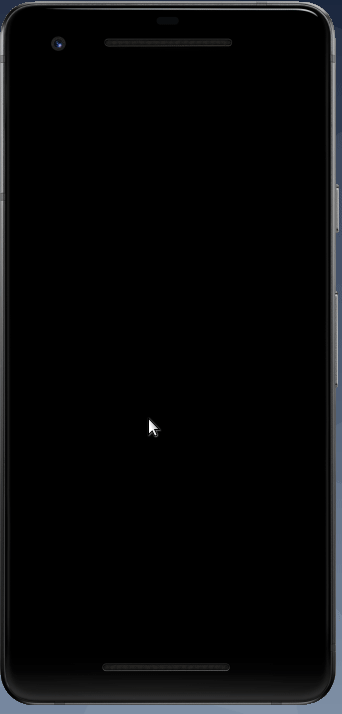

# Rate repository App

Repo for FullStack open excersises for part 10. React Native

## Demo example gif of current(ish) version off app

Here is what the app currently looks like...

## Exercises done

- [x] Exercise 10.1
- [x] Exercise 10.2
- [x] Exercise 10.3
- [x] Exercise 10.4
- [x] Exercise 10.5
- [x] Exercise 10.6
- [x] Exercise 10.7
- [x] Exercise 10.8
- [x] Exercise 10.9
- [x] Exercise 10.10
- [x] Exercise 10.11
- [x] Exercise 10.12
- [x] Exercise 10.13
- [x] Exercise 10.14
- [x] Exercise 10.15
- [x] Exercise 10.16
- [x] Exercise 10.17
- [ ] Exercise 10.18
- [ ] Exercise 10.19
- [ ] Exercise 10.20
- [ ] Exercise 10.21
- [ ] Exercise 10.22
- [ ] Exercise 10.23
- [ ] Exercise 10.24
- [ ] Exercise 10.25
- [ ] Exercise 10.26
- [ ] Exercise 10.27