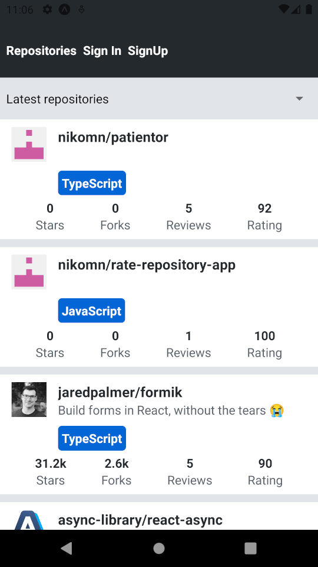
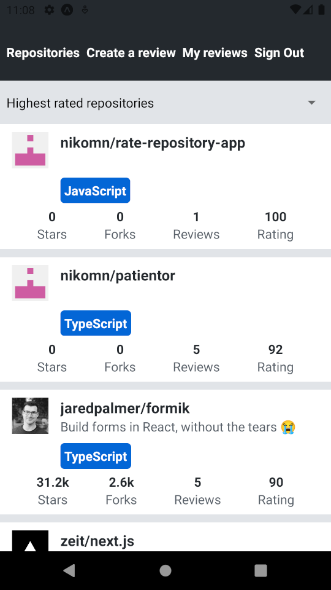
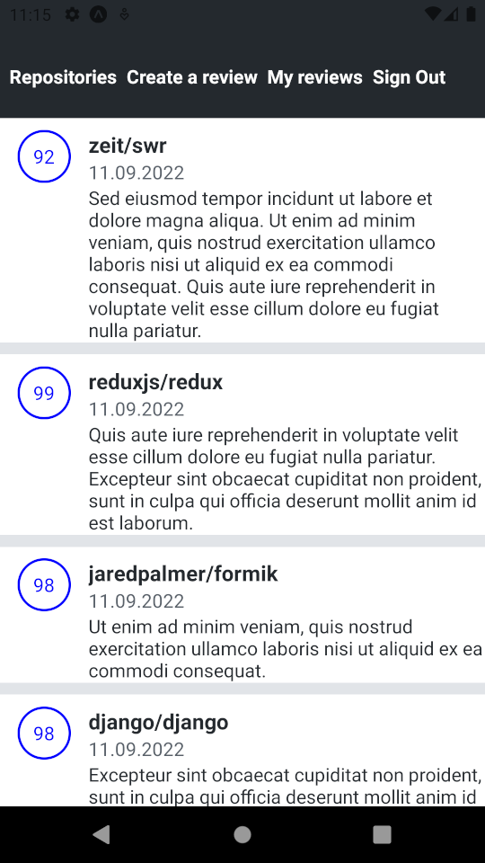

# Implemented features

Here are examples of most of the features implemented

## Repository list with sorting

## Single repository view

## Signup

## Signin

## Additional features available for logged in users

When logged in users can for example create new reviews

### Creating review 

### Users reviews list

